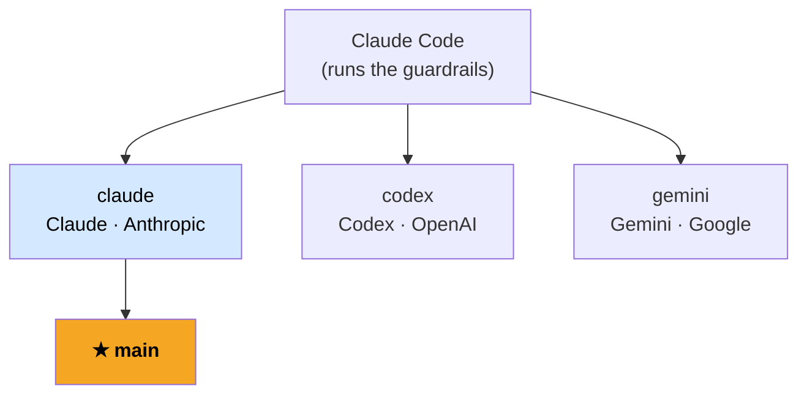

# Notiflex Platform

[한국어](README.md) | **English**


&nbsp;


> 📖 **This repository is the output of a hands-on practice from a Korean book.** This English page explains the project at a glance. Operational documents inside the repo (ADRs, onboarding, architecture snapshots) were **generated by the AI agents themselves** during the practice and are kept in their original Korean — they are preserved as authentic artifacts, not translated after the fact.

This is the practice repository for the book *"Infrastructure Provisioning & Deployment for the AI Era — with Claude Code."* Built on the guardrails and execution steps from [sysnet4admin/_Book_GitAIOps](https://github.com/sysnet4admin/_Book_GitAIOps), it is a B2B notification SaaS platform that **AI agents constructed on GKE on their own** — provisioning, deploying, and recording decisions as they went.

## Branch structure — one branch per AI agent

The exact same guardrails were executed by different AI agents, and each agent's result is preserved on its own branch.



All three branches used **Claude Code as the execution tool**; what differs is the model wired underneath it. One of this repo's goals is to compare how the outcome changes given the same guardrails but a different model. `main` reflects the `claude` branch after review.

Compare each branch's `docs/architecture-decisions.md` to see how the same 16 decisions (ADR-001 ~ ADR-016) differ in substance and wording across agents.

## Layout

| Directory | Contents |
|-----------|----------|
| `app/` | Notiflex Go API (Valkey INCR, Kafka producer, OTel tracing) |
| `k8s/smb/` | SMB tenant manifests (Rollout, Service, Gateway, CronJob) |
| `k8s/enterprise/` | Enterprise tenant manifests |
| `k8s/kafka/` | Strimzi Kafka cluster (KRaft, v4.1.0) |
| `k8s/monitoring/` | PrometheusRule |
| `argocd/` | ArgoCD App of Apps (root-app + apps/) |
| `helm-values/` | Helm chart values |
| `docs/` | ADR-001 ~ 016 architecture decision records |
| `claude-context/` | Architecture snapshot for AI reference |

## The GitAIOps three layers

```
CLAUDE.md          → Project metadata for the AI (auto-loaded every session)
claude-context/    → Current architecture snapshot (for AI reference)
docs/ADR           → Accumulated team decisions (reviewed by humans + AI)
```

Git is the single source of truth for the infrastructure, and the AI is a living author of the operational standard.

## Quick start

See `ONBOARDING.md` (in Korean — it is one of the AI-generated artifacts described above).
