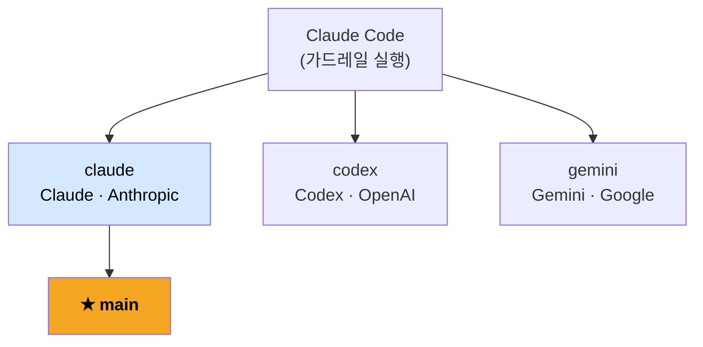

# Notiflex Platform

「AI 시대에 개발자가 알아야 하는 인프라 구성 배포 with 클로드 코드」의 실습 저장소입니다.

[sysnet4admin/_Book_GitAIOps](https://github.com/sysnet4admin/_Book_GitAIOps)의 가드레일과 실행 지침을 기반으로, AI 에이전트가 B2B 알림 SaaS 플랫폼을 GKE 위에 직접 구축한 결과물입니다.

## 브랜치 구조 — AI 에이전트별 실행 결과

동일한 가드레일을 서로 다른 AI 에이전트가 실행한 결과가 브랜치별로 보존되어 있습니다.



세 브랜치 모두 Claude Code를 실행 도구로 사용했습니다. 동일한 가드레일 위에서 어떤 모델을 연결하느냐에 따라 결과가 어떻게 달라지는지 비교하는 것이 이 저장소의 목적 중 하나입니다. `main`은 claude 브랜치를 검토한 뒤 반영한 브랜치입니다.

같은 지침을 주었을 때 에이전트마다 어떤 결과가 나오는지 비교하는 것이 이 저장소의 목적 중 하나입니다. 각 브랜치의 `docs/architecture-decisions.md`에서 ADR-001~016의 내용과 표현 방식 차이를 확인할 수 있습니다.

## 구성

| 디렉터리 | 내용 |
|---------|------|
| `app/` | Notiflex Go API (Valkey INCR, Kafka Producer, OTel 트레이싱) |
| `k8s/smb/` | SMB 테넌트 매니페스트 (Rollout, Service, Gateway, CronJob) |
| `k8s/enterprise/` | Enterprise 테넌트 매니페스트 |
| `k8s/kafka/` | Strimzi Kafka 클러스터 (KRaft, v4.1.0) |
| `k8s/monitoring/` | PrometheusRule |
| `argocd/` | ArgoCD App of Apps (root-app + apps/) |
| `helm-values/` | Helm 차트 설정값 |
| `docs/` | ADR-001~016 아키텍처 결정 기록 |
| `claude-context/` | AI 참조용 아키텍처 스냅샷 |

## GitAIOps 3층 구조

```
CLAUDE.md          → AI에게 프로젝트 메타데이터 제공 (매 대화 자동 로드)
claude-context/    → 현재 아키텍처 스냅샷 (AI 참조용)
docs/ADR           → 팀의 결정 누적 기록 (사람 + AI가 함께 검토)
```

Git이 인프라의 단일 진실 소스이고, AI가 운영 표준의 살아있는 저자입니다.

## 빠른 시작

`ONBOARDING.md`를 참조하세요.
